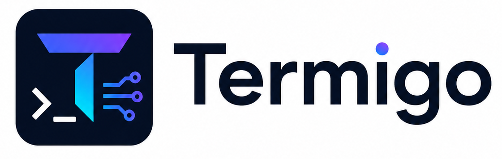

# Termigo

<p align="center">
  
</p>

<p align="center">
  <strong>A lightweight, terminal-first workspace for AI-assisted development.</strong>
</p>

Termigo is a focused desktop workspace for developers who want the daily loop in
one small window: terminals, files, code editing, local preview, coding agents,
and a practical command-line companion. It is deliberately not a full IDE.

Maintained by [99apps-id](https://github.com/99apps-id).

> **Status: architecture transition.** This repository currently contains an
> early Go/Wails prototype. The product is being re-based onto a Rust/Tauri
> desktop shell, while Go becomes the companion CLI and local automation layer.
> The new desktop implementation has not been migrated yet.

## Product direction

Termigo is for developers who prefer a terminal-first workflow without giving
up the few visual tools that genuinely save time.

- **Terminal first** - persistent shell sessions, tabs, splits, and project-aware working directories.
- **Small by design** - native OS webview and a target installer size below 20 MB.
- **Local first** - folders, commands, keys, and project context stay on the machine.
- **Agent ready** - use installed coding CLIs now; add managed providers, BYOK, local models, skills, and MCP progressively.
- **Not an IDE clone** - no extension marketplace, debugger suite, or broad language-server platform as the core product.

## Planned experience

| Surface | Purpose |
| --- | --- |
| **Terminal** | Multiple persistent shells, tabs, splits, search, and background output. |
| **Workspace** | Open folders, a fast file tree, recent projects, and restored sessions. |
| **Editor** | A compact code editor for reading, changing, and reviewing files near the terminal. |
| **Preview** | An in-app browser for local development servers. |
| **Agent** | A dedicated chat/composer that can invoke approved local tools and present edits for review. |
| **Provider hub** | OAuth, API-key, local-model, and existing-CLI connections without forcing a single vendor. |
| **Git** | Focused changed-files, diff, branch, commit, and history workflows. |
| **Skills and MCP** | Project-scoped skills and explicit, permission-aware MCP integrations. |

## Architecture

```text
Termigo
|
|-- Desktop application
|   |-- Rust + Tauri 2       native window, PTY, secure OS integrations
|   `-- React + TypeScript   terminal, editor, explorer, preview, agent UI
|
`-- termigo CLI
    `-- Go                  automation, local agent helpers, project commands
```

Rust/Tauri is chosen for the desktop application because it provides a compact
native shell and mature terminal/desktop primitives. Go remains a first-class
part of Termigo, but belongs in the CLI and automation layer rather than being
forced to reproduce the entire desktop surface.

## CLI seed

The first Go component is available now: `termigo doctor`. It is deliberately
small and only checks executable availability and version output; it never reads
provider credentials.

```powershell
Set-Location cli
go run ./cmd/termigo help
go run ./cmd/termigo doctor
go run ./cmd/termigo doctor --json
go build -trimpath -ldflags '-s -w' -o .\bin\termigo.exe .\cmd\termigo
```

`doctor` currently checks the desktop prerequisites (Rust, Cargo, Node.js, npm,
and Git) and locally installed agent tools (Codex, Gemini, Antigravity, and
Ollama). Future subcommands will handle workspace actions and local automation.

## Roadmap

1. **Re-baseline** - establish the Rust/Tauri desktop shell, branding, updater strategy, size budget, and Windows build pipeline.
2. **Daily workspace** - add durable workspace sessions, multi-tab/split terminals, explorer, editor, preview, and Git basics.
3. **Agent workflow** - add a provider hub, model selection, BYOK/OAuth, local models, approvals, diffs, and task history.
4. **Extensibility** - add project skills, MCP, and the Go `termigo` CLI.
5. **Polish** - improve startup, accessibility, settings, recovery, installers, and cross-platform support.

## Current prototype

The existing Go/Wails experiment can open a folder, edit text files, run a
Windows terminal, display a local preview, and detect installed CLIs. It is a
temporary proof of direction, not the intended long-term desktop architecture.

For maintenance of the current prototype:

```powershell
go vet ./...
go test ./...
Set-Location frontend
npm run build
```

## Privacy and safety

- Local project files must remain within the selected workspace boundary.
- Secrets should be stored only in the operating-system keychain or entered by
  the user; Termigo must never commit or log them.
- Agent file changes and commands require clear review and approval controls.
- Telemetry is opt-in. The default product direction is private and local-first.

## Upstream and attribution

Termigo takes product inspiration from the terminal-first workspace category.
No TEDI source code is currently included in this repository. If a future
Termigo component is forked from Apache-2.0 upstream code, its license, notices,
copyright statements, and required attribution will be preserved in that change.

## Contributing

The Rust/Tauri migration is the priority. Please keep proposals small, focused,
and aligned with the terminal-first and local-first principles. Do not add broad
IDE features without a clear user workflow and a size/performance justification.

## License

License selection is pending. Until a license is added, do not assume this
repository may be redistributed.
