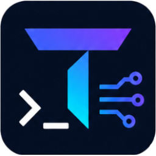
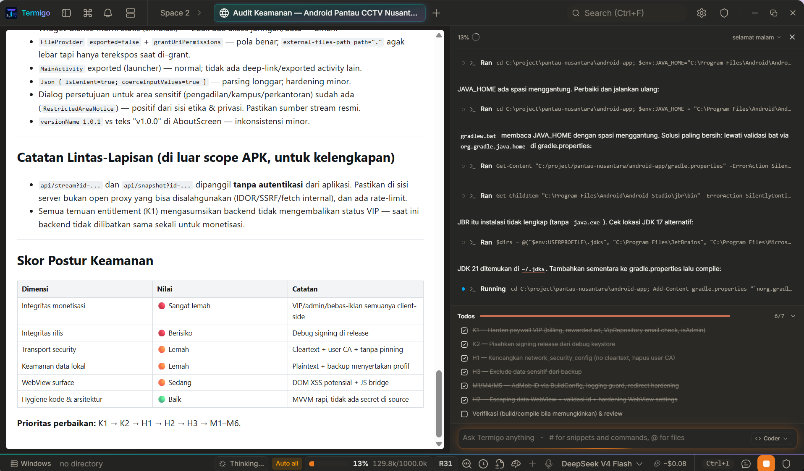

<div align="center">
  
  <h1>Termigo</h1>

  <p><strong>Terminal-first, AI-native development workspace.</strong></p>
  <p>
    <a href="https://github.com/99apps-id/termigo">Repository</a>
    ·
    <a href="#features">Features</a>
    ·
    <a href="#getting-started">Getting started</a>
    ·
    <a href="#cli">CLI</a>
    ·
    <a href="#credits">Credits</a>
  </p>

  <p>
    
    
    
    
  </p>
</div>

---

**Termigo** is a lightweight open-source, terminal-first AI-native development
environment (ADE) built on **Tauri 2 + Rust** with a **React 19** frontend. A
native PTY backend, an agentic AI side-panel that runs against your own keys or
fully local models, a code editor, file explorer, source control with a git
graph, and a web preview pane, all in one window. **No telemetry. No account.**
Your API keys stay in the OS keychain or with the provider's own CLI.

This project is a **fork of [Terax](https://github.com/crynta/terax-ai)**
(by Crynta, Apache-2.0), extended with a **Go command-line companion**
(`termi-go`) for automation: agent runs, MCP, skills, and project scaffolding.

## Features

### Terminal

- Native PTY backend via `portable-pty` (pwsh, powershell, cmd, zsh, bash, fish)
- xterm.js with WebGL renderer, multi-tab with background streaming
- Split panels (horizontal and vertical)
- Inline search, link detection, true-color
- Drag files from the explorer into a terminal as shell-safe quoted paths
- Per-tab workspace environments on Windows (Local or WSL distro)
- Spaces restore tabs, working directories, and split layouts across launches

### SSH & remote files

- Connect to remote hosts with **ssh-agent**, private key, or password auth,
  directly as a terminal tab (ProxyJump chains supported)
- First-connect **host-key verification** (trust-on-first-use with fingerprint
  pinning): the handshake pauses until you confirm
- **SFTP file explorer**: browse, create, rename, delete, upload (drag & drop)
  and download over the active SSH session
- Port forwarding (`-L`) through the session

### AI agent

- **BYOK providers:** OpenAI, Anthropic (Claude), Google (Gemini), Groq,
  xAI (Grok), Cerebras, OpenRouter, DeepSeek, Mistral, plus any
  OpenAI-compatible endpoint
- **Local / offline:** LM Studio, MLX, Ollama
- **Skills.** The agent writes reusable procedures for itself in
  `.termigo/skills/<name>/SKILL.md` — a deploy sequence, a debugging route that
  worked, a release checklist — and reads them back in later sessions. This is
  what makes it better over time rather than merely better informed: memory
  stops a session starting from zero, a skill means a procedure worked out once
  never has to be worked out again. Re-saving a name replaces it, so a skill
  improves with use. Only names and descriptions reach the system prompt;
  bodies load on demand through `use_skill`, so a shelf of skills costs almost
  nothing until one is needed. Plain Markdown with frontmatter, so you can read,
  edit or delete any of them by hand. `find_skill` searches every skill library
  on the machine on demand — your own, and those installed by other agent tools
  — so a large collection stays reachable without any of it sitting in the
  prompt. Skills written for another agent still parse, and `use_skill` says so
  when one calls tools Termigo does not have.
- **Self-maintaining memory.** The agent records durable project facts in
  `.termigo/memory.md` and reads them back in every later session, so build
  commands, conventions and decisions do not have to be re-explained. Facts are
  captured two ways: a `remember` tool the model calls deliberately (visible in
  the transcript, approval-gated like any workspace write), and a summary sweep
  when a session is left behind. Your hand-written `TERMIGO.md` is never
  rewritten, so you can always tell what you wrote from what the agent
  inferred, and deleting a line makes it forget. The file is bounded in entry
  length, entry count and total size, because everything in it costs context on
  every request. The sweep only runs in the auto-approve modes: in
  `Ask every time`, nothing is written without a click.
- Agentic workflow: plans, sub-agents, project memory via `TERMIGO.md`,
  file read/write/edit/multi-edit/grep/glob, bash with approval gating,
  background processes
- Tool calls are **approval-gated**; approvals resume the run (including
  OpenAI-compatible providers such as DeepSeek)
- **Graduated auto-approval.** Choose how much the agent may do without
  stopping: `Ask every time` (default), `Auto-approve edits` (file changes in
  the workspace run, commands and agent hand-offs still ask), or
  `Auto-approve all`. The mode is always visible in the AI status bar, never
  buried in settings. Crucially it changes only *what stops for a click*: the
  path and shell-command safety checks run inside every tool regardless, so no
  mode can authorise something the safety layer refuses. Read-only tools never
  asked in the first place.
- **Agent works on the remote host.** When the active terminal is an SSH
  session, the agent's file tools act on the server: `read_file`,
  `list_directory`, `write_file`, `create_directory`, `edit`, `multi_edit`,
  `move_file` and `delete_file` all go over SFTP. Windows drive paths (`C:\...`)
  still mean this machine, since they cannot mean anything on a POSIX host.
  `grep` and `glob` search the server too, using its own `grep` and `find` over
  a dedicated exec channel rather than walking the tree over SFTP — one command
  instead of thousands of round trips. Every value interpolated into those
  commands is single-quoted, so a pattern cannot become a second command.
  `bash_run` runs on the server too, from the remote shell's working directory,
  so the agent can install packages, reload Caddy or bring a compose stack up
  without you relaying commands. **A command on a remote host always asks for
  approval, in every approval mode including `Auto-approve all`** — the safety
  layer's boundary is "inside this workspace", and a command on someone else's
  machine has no equivalent, so that is the one place a mode is not allowed to
  speak for you. `replace_in_files`, `copy_file` and `bash_background` still
  have no remote form and refuse while a session is open, saying what to use
  instead rather than quietly acting on your own disk.
- **Extension tools.** An extension that declares `contributes.aiTools` in its
  manifest has those tools offered to the agent as `ext__<extension>__<tool>`,
  with the JSON Schema and approval preference it declared. Like MCP tools they
  never ride along with `Auto-approve edits`, since that mode is a statement
  about files in your workspace, not about third-party code.
- **MCP servers.** Tools from any configured Model Context Protocol server are
  offered to the agent alongside the built-in ones, named `mcp__<server>__<tool>`
  so their origin stays visible in the transcript. Configure them in
  `.termigo/mcp.json` in the workspace, or `~/.termigo/mcp.json` for every
  project, using the standard `mcpServers` shape:

  ```json
  {
    "mcpServers": {
      "github": {
        "command": "npx",
        "args": ["-y", "@modelcontextprotocol/server-github"],
        "env": { "GITHUB_TOKEN": "..." }
      }
    }
  }
  ```

  A project entry overrides a user entry of the same name, and the same file is
  read by the Go companion CLI, so a server configured once works in both. MCP
  tools always ask for approval, including under `Auto-approve edits`: that mode
  is a statement about files in this workspace, not about arbitrary third-party
  actions. A server that fails to start costs only its own tools, not everyone
  else's.
- Coding-agent orchestration: spawn Claude Code in a terminal, inspect output,
  send follow-up work through approval-gated tools
- Composer: prompt snippets via `#handle`, files via `@path`, voice input
- Custom agents with their own system prompt and tool subset
- Plan mode for multi-step work, generates and confirms before doing

### Code editor

- CodeMirror 6 with support for TS/JS, Rust, Python, Go, C/C++, Java,
  HTML/CSS, JSON, Markdown and more
- Inline AI autocomplete with local model support
- AI edit diffs, accepted or rejected hunk by hunk
- Opt-in language server support (diagnostics, navigation, completion, formatting)
- Rendered Markdown plus image, video, audio, and PDF viewing
- Vim mode and built-in editor themes (Kanagawa, Catppuccin, Rosé Pine, Dracula, ...)

### Source control

- Stage / unstage hunks, commit (`Cmd+Enter` / `Ctrl+Enter`), push with
  upstream awareness
- Branch display including detached HEAD state
- Git history pane with a real commit graph (lane rendering for merges/branches)
- Commit search and filter, click through to the remote commit page

### Explorer & preview

- Catppuccin icon theme, fuzzy search, keyboard navigation, inline rename,
  live updates when files change on disk
- Attach files and selections directly to the AI side-panel
- Web preview auto-detects local dev servers; external URLs open in a child webview

### Themes & customization

- Custom themes built in-app, bundled presets, background images with
  adjustable opacity and blur
- Editor theme is independent from the app theme

## Getting started

### Prerequisites

- [Rust](https://rustup.rs) (stable)
- [Node.js](https://nodejs.org) 22+ and [pnpm](https://pnpm.io)
- [Tauri platform prerequisites](https://tauri.app/start/prerequisites/)
  (Windows: MSVC Build Tools; Linux: webkit2gtk; macOS: Xcode CLT)

### Run from source

```bash
pnpm install
pnpm tauri:dev       # development
pnpm tauri build     # production bundle
```

Checks:

```bash
pnpm check-types     # tsc --noEmit
pnpm test            # vitest
cd src-tauri && cargo clippy --all-targets -- -D warnings && cargo test
```

### Windows notes

- Default shell detection: `pwsh.exe` (PowerShell 7+) → `powershell.exe` →
  `cmd.exe`
- WSL is a first-class workspace environment, not a wrapped subprocess

## CLI

Termigo ships **two** separate command-line programs. They do different jobs,
and only the first one is installed with the app.

### 1. Control CLI (Rust, bundled with the app)

Installed alongside the desktop app as `termigo`. It talks to a **running**
Termigo window over the local control socket:

```bash
termigo README.md              # open a file in the running app
termigo README.md --line 42    # open at a line
termigo open README.md         # explicit form of the same thing
termigo ping                   # is the app reachable?
termigo capabilities           # what this build supports
termigo identify               # which window/pane answered
termigo help
```

It does **not** know `agent`, `mcp`, `skill`, `doctor` or `init`. Those belong
to the Go companion below, and asking this binary for them now says so.

### 2. Go companion (automation)

Lives in [`cli/`](cli/) and is **not** installed by the app. It automates what
the desktop surfaces interactively and runs without the app open.

```bash
cd cli
go build -o termi-go ./cmd/termigo   # or: go run ./cmd/termigo <args>
```

Name the binary something other than `termigo` (for example `termi-go`), or
put it on `PATH` ahead of the control CLI. Two binaries with the same name is
exactly what makes `termigo agent list` fail confusingly.

```bash
./termi-go help
./termi-go doctor --json                # inspect local tools
./termi-go init <dir>                   # scaffold .termigo/ + TERMIGO.md
./termi-go agent list                   # installed agent providers
./termi-go agent run codex "explain this repo" --access read-only
./termi-go skill create review "Review diffs before commit"
./termi-go mcp list                     # configured MCP servers
./termi-go mcp tools fs                 # list tools of an MCP server
./termi-go config                       # show user configuration
```

- **Providers:** Codex, Claude Code, Gemini, Antigravity, Ollama (local).
  `agent run` drives Codex, Claude and Gemini in print mode and Ollama over its
  local HTTP API; a provider with no headless mode is reported rather than
  launched blind.
- **Provider overrides:** `providers.<id>.command` in `~/.termigo/config.json`
  points at a CLI installed outside `PATH`; `model` and `endpoint` are honoured
  the same way.
- **Skills:** project- and user-scoped `SKILL.md` folders under
  `.termigo/skills/` and `~/.termigo/skills/`
- **MCP:** standard `mcpServers` registry in `.termigo/mcp.json`, JSON-RPC 2.0
  over stdio (initialize, tools/list, tools/call, ping)
- **Never stores API keys**: credentials stay with each provider's own CLI

See [`docs/`](docs/) for the MCP, skills, agents, and architecture guides.

## Screenshots

<p align="center">
  
  <br/>
  <sub>
    Agent run under review: a <code>write_file</code> call held at the approval
    gate, its diff open in the editor, todos tracking the plan, and spaces
    across the top
  </sub>
</p>

## Architecture

```text
Termigo
|-- Desktop application        Rust + Tauri 2 + React 19 + TypeScript
|   |-- src-tauri/             PTY, shell, git, agents, workspace, control
|   `-- src/                   React UI (terminal, editor, AI, git, explorer)
`-- termigo CLI                Go
    `-- cli/                   agent, mcp, skill, config, doctor, init
```

A Tauri 2 app: a React 19 webview talks to a Rust backend via `invoke()` and
streaming `Channel`s. The Go CLI is the automation layer: anything useful
headlessly lives in `cli/internal/` first.

## Privacy and safety

- **Local first.** Folders, commands, keys, and project context stay on the
  machine. No telemetry, no account.
- **Keys stay with their owners.** Provider credentials live in the provider's
  own CLI config or the OS keychain.
- **Approval gates.** Agent file changes and commands require review/approval;
  the workspace is the boundary for file operations.
- **MCP is explicit.** Servers only run when you configure and connect to them.

## Credits

Termigo is a **fork of [Terax](https://github.com/crynta/terax-ai)** by
[Crynta](https://github.com/crynta) (Apache-2.0). The Tauri/Rust backend, the
xterm.js terminal, the CodeMirror editor, and the AI agent pipeline are the
work of Crynta and the Terax contributors. If Termigo is useful, please star
upstream [Terax](https://github.com/crynta/terax-ai).

The design also draws inspiration from
[TEDI](https://github.com/IlhamriSKY/TEDI) (a Terax fork by Ilham Riski
Wibowo) for its "one window, many tools" direction. No TEDI source code is
included in this repository.

## License

[Apache-2.0](LICENSE), the same license as the upstream Terax project.
