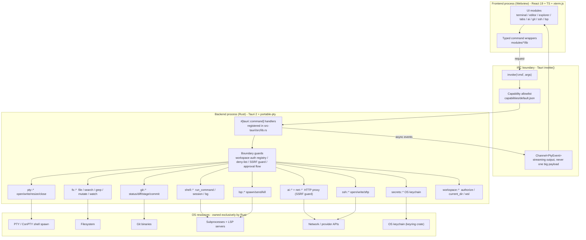
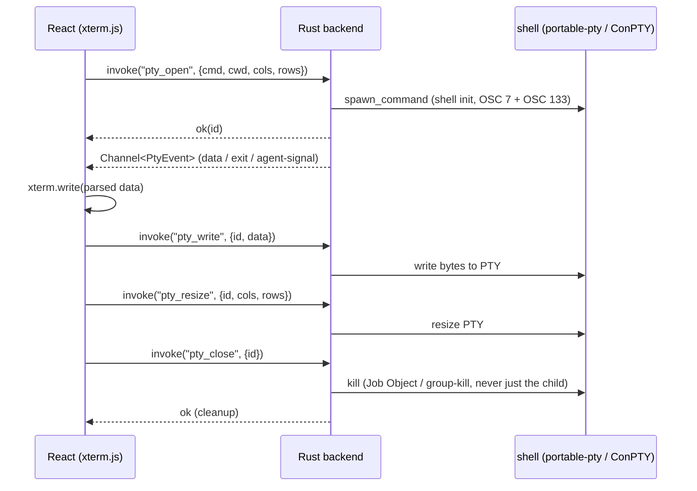

# Two-process architecture (mermaid)

Diagram versi visual dari [two-process model](two-process-model.md) dan `TERMIGO.md`.

## Arsitektur keseluruhan

## Alur session PTY (data stream)

## Invariant yang dijaga

- Webview **tidak pernah** menyentuh FS, proses, atau shell secara langsung; semua lewat `invoke()` ke command yang terdaftar.
- Command baru harus didaftarkan di `lib.rs` **dan** di-guard di boundary (workspace auth, deny-list, SSRF, approval flow).
- Plugin API yang dipakai webview harus ada di `capabilities/default.json`, atau tidak ada.
- Input tak tepercaya (escape sequence terminal, isi file, hasil tool AI) di-parse dan divalidasi di Rust, tidak dieksekusi oleh renderer.
- Output panjang (PTY, log) mengalir lewat `Channel`, bukan dikembalikan sekaligus.
