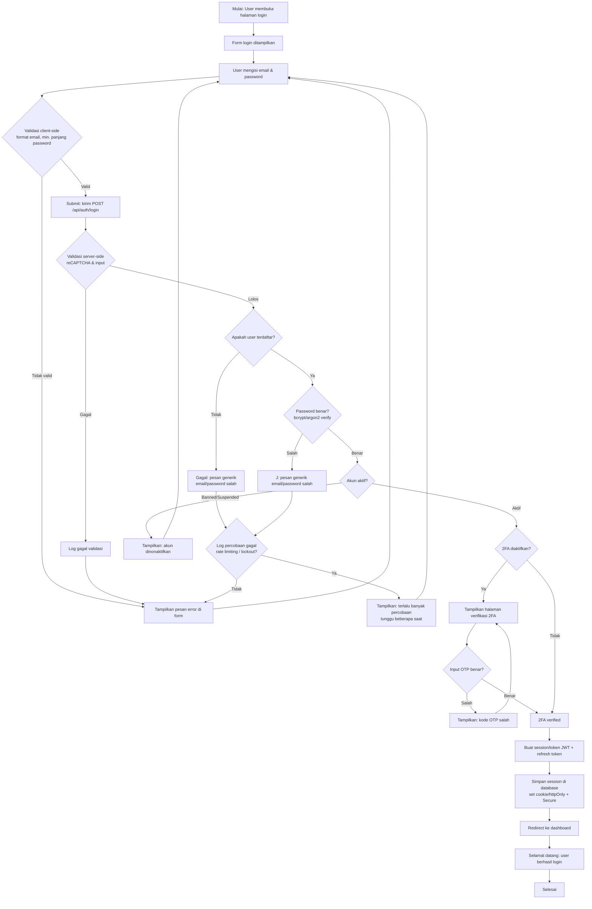

# Alur Login User

## Keterangan alur

1. **Validasi client-side**: pemeriksaan cepat (format email, field wajib) untuk UX, bukan pengaman.
2. **Validasi server-side**: pemeriksaan otoritatif. Selalu dilakukan ulang di server, jangan percaya client.
3. **Pesan generik**: jangan membocorkan apakah email terdaftar; gunakan pesan yang sama untuk "email tidak ada" dan "password salah" agar tidak terjadi enumerasi user.
4. **Rate limiting / lockout**: setiap percobaan gagal dicatat; setelah N percobaan (mis. 5), akun/IP dikunci sementara.
5. **2FA**: dilewati jika user tidak mengaktifkannya; jika aktif, OTP wajib sebelum session dibuat.
6. **Session**: gunakan token berumur pendek (JWT access token) + refresh token; cookie diberi flag `HttpOnly`, `Secure`, dan `SameSite` untuk keamanan.
